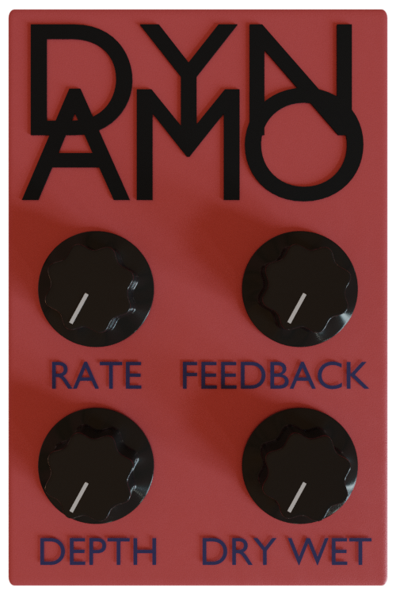

# Dynamo (Simple Flanger)


Dynamo is a simple [flanger](https://en.wikipedia.org/wiki/Flanging).

### Controls
* Rate - Controls the time it takes for one phase to complete
* Feedback - How much of the effect is fed back in to the effect
* Depth - Depth of how much the phase is delayed from the input sound
* Dry Wet - Slider which controls balance between the unaffected input sound and the effected output sound

### Compilation
Dynamo is completely built on the [iPlug2](https://github.com/iPlug2/iPlug2) library

To build Dynamo, first setup iPlug2 by following the [MacOs](https://github.com/iPlug2/iPlug2/wiki/01_Getting_started_mac_ios) or [Windows](https://github.com/iPlug2/iPlug2/wiki/02_Getting_started_windows) guild up until the "Start your own, new project" step

After that, enter iPlug2's examples directory and use the python script to clone IPlugEffect
```
$ cd iPlug2/examples
$ python duplicate.py IPlugEffect Dynamo Dragonsploder
```
Replace the newly created files (located in the new folder Dynamo) Dynamo.cpp and Dynamo.h by the files in this repository

Follow the rest of IPlug2's build instructions